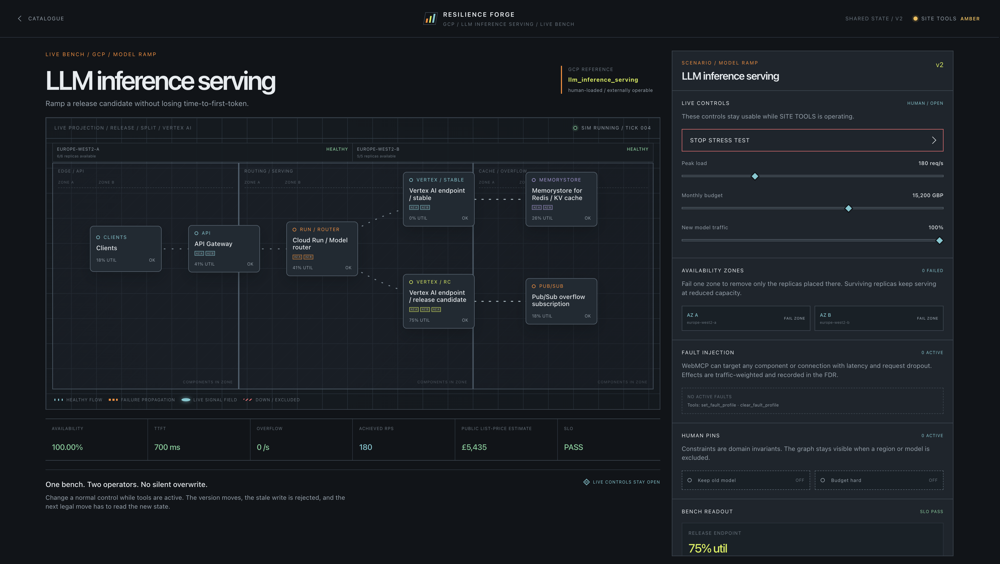

# Live smoke test — 2026-08-27

Target: [resilience-forge.gman72.chatgpt.site](https://resilience-forge.gman72.chatgpt.site/)

Environment: standard browser automation (no WebMCP runtime). WebMCP tool registration requires ChatGPT desktop in-app browser or Chrome 149+ with `chrome://flags/#enable-webmcp-testing`.

## Results

| Step | Result |
| --- | --- |
| Catalogue loads | PASS — three equal reference cards visible |
| `/bench/event_driven_checkout` | PASS — topology, gauges, scenario controls render |
| Checkout stress (`Run Pub/Sub stress`) | PASS — Pub/Sub WARN, SLO breach, queue overflow reported |
| `/bench/multi_region_saas` | PASS — regional topology, traffic split slider, fail-region control |
| `/bench/llm_inference_serving` | PASS — model split slider, Vertex endpoints, ramp stress control |
| LLM ramp stress | PASS — release endpoint utilisation rises, SLO evaluated |
| SITE TOOLS lamp | AMBER (expected) — `document.modelContext` unavailable outside WebMCP browser |
| Human controls during stress | PASS — sliders and pins remain enabled |

## Judge path (manual, WebMCP browser)

1. Open the live URL in ChatGPT desktop in-app browser.
2. Load any reference from Catalogue manually.
3. Confirm SITE TOOLS is **green** and `get_webmcp_status.toolsReady` is true. Tool count matches `expectedToolCount` for the loaded architecture.
4. Ask the agent to call `get_bench_guide`, then `get_bench_snapshot`.
5. Run `run_stress_test`, attempt remediation, then change peak load or traffic split while the agent works.
6. Verify stale mutation returns `STALE_STATE`, FDR flashes, `get_decision_log` shows the human `ui` event, and a retry with the new `expectedVersion` succeeds.
7. Pin Keep Pub/Sub ordering and confirm `unordered: true` returns `PINNED_KEEP_PUBSUB_ORDERING`.

Capture `docs/site-tools-green.png` from this ChatGPT session before Devpost submit.

## Screenshot

Capture green SITE TOOLS in ChatGPT in-app browser before Devpost submit — standard browsers cannot register tools.
